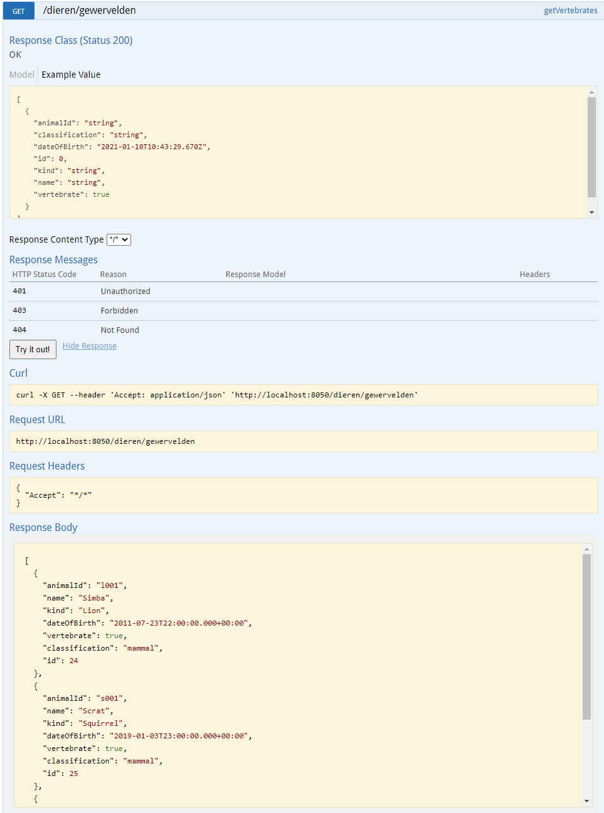
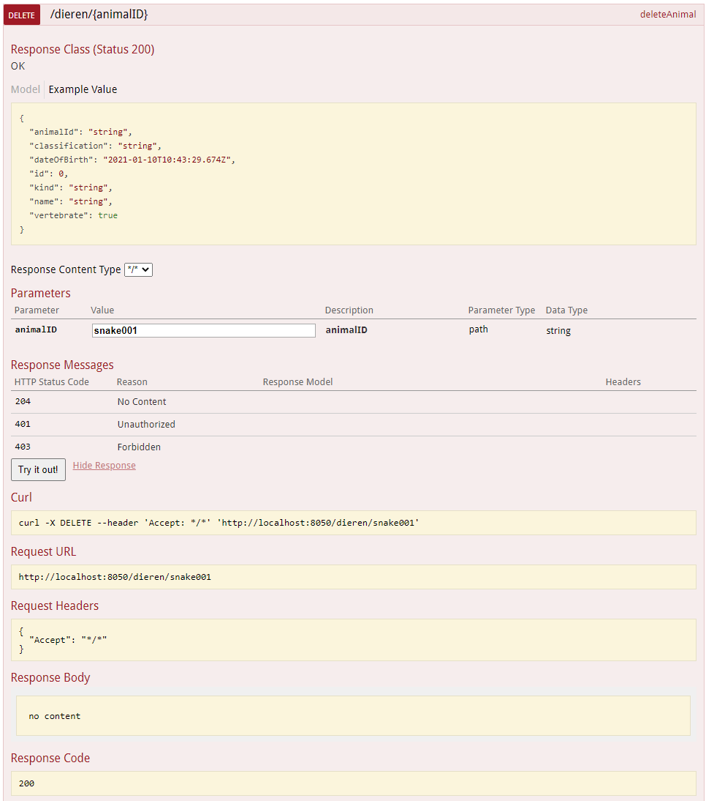

# De zoo
Dit is de edge microservice voor het OPO Advanced Programming Topics.

Met dit project kun je de verschillende dieren, het personeel en de verblijven van dieren opvragen en gebruiken.

Hieronder vindt u de links naar de andere microservices:
- [Dieren](https://github.com/Ferwardo/dezoo-dieren)
  
- [Personeel](https://github.com/Ferwardo/dezoo-personeel)
  
- [Verblijven](https://github.com/Ferwardo/dezoo-verblijven)

- [Front end](https://github.com/Ferwardo/dezoo-front)

## Diagram microservices
In onderstaand diagram vindt u de architectuur gebruikt in ons project.

## Overzicht van de functionaliteiten in swagger

### Dieren

#### Get

#### Post

#### Put

#### Delete

### Personeel

#### Get

#### Post

#### Put

#### Delete

### Verblijven

#### Get

#### Post

#### Put

#### Delete

